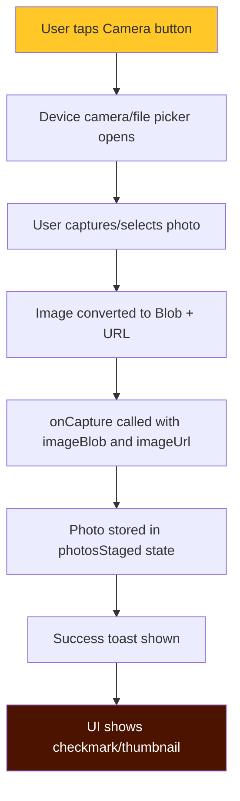

# 🔒 PHOTO CAPTURE - LOCKED CONFIGURATION (NO OCR)

> **CRITICAL**: This document defines the locked photo capture system for KanggaXpress Identity Verification.
> ALL future changes MUST maintain the NO-OCR approach to prevent processing errors and complexity.

## 🚨 NON-NEGOTIABLE RULES

### 1. NO OCR PROCESSING - EVER
- **Identity Verification uses SIMPLE PHOTO CAPTURE ONLY**
- No text recognition, no document parsing, no AI processing
- Photos are uploaded as-is for manual admin review
- This prevents OCR errors, complexity, and user frustration

### 2. LOCKED COMPONENTS (DO NOT CHANGE)
```tsx
// ✅ CORRECT - Use PhotoCaptureCard
import { PhotoCaptureCard } from '@/components/PhotoCaptureCard';

// ❌ WRONG - Do NOT use OcrCaptureCard
import { OcrCaptureCard } from '@/components/ocr/OcrCaptureCard';
```

### 3. SIMPLE PHOTO STORAGE (LOCKED)
```typescript
// 🔒 LOCKED: Simple photo staging - NO OCR data
interface PhotoStaged {
  docType: DocType;
  imageBlob: Blob;
  imageUrl: string;
  // ❌ DO NOT ADD: parsed, confidence, or any OCR fields
}
```

### 4. KYC DOCUMENT UPLOAD (LOCKED)
```typescript
// 🔒 LOCKED: Upload photos without OCR
await kycService.createKycDocument({
  user_id: userId,
  doc_type: photo.docType,
  parsed: {},  // 🔒 ALWAYS empty - no OCR data
  confidence: 1.0,  // 🔒 ALWAYS 1.0 - no OCR confidence
  status: 'PENDING',
  image_path: imagePath,
});
```

### 5. USER MESSAGES (LOCKED)
```typescript
// ✅ ALLOWED MESSAGES
"Photo Captured"
"ID photo saved successfully"
"Selfie photo saved successfully"
"Failed to upload image. Please try again."

// ❌ FORBIDDEN MESSAGES - DO NOT ADD
"OCR failed"
"Processing document..."
"Low confidence score"
"Failed to process document"
"Scanning text..."
```

## 📋 IDENTITY VERIFICATION CHECKLIST

Before modifying Identity Verification code, verify:

- [ ] Uses `PhotoCaptureCard` component (NOT `OcrCaptureCard`)
- [ ] No OCR imports (`@/components/ocr/*`, `@/lib/ocr/*`, `@/lib/ocrProvider`)
- [ ] No OCR processing functions (`performOcr`, `mapFieldsToSchema`, etc.)
- [ ] Photos stored with empty `parsed: {}` object
- [ ] No confidence calculations (always `1.0`)
- [ ] No OCR error handling or messages
- [ ] Success messages are simple and clear
- [ ] Camera button shows icon only (48px tap target)
- [ ] Works on mobile without errors

## 🛡️ PROTECTED FILES

These files contain locked photo capture configurations:

### src/pages/auth/Auth.tsx
```tsx
/* 🔒 LOCKED: Simple photo capture for Identity Verification
 * 
 * CRITICAL: Uses PhotoCaptureCard - NO OCR processing
 * DO NOT replace with OcrCaptureCard or add OCR logic
 * 
 * See: PHOTO_CAPTURE_LOCKED.md for complete guidelines
 */

// ✅ CORRECT imports
import { PhotoCaptureCard } from '@/components/PhotoCaptureCard';

// ❌ DO NOT import these
// import { OcrCaptureCard } from '@/components/ocr/OcrCaptureCard';
// import { performOcr } from '@/lib/ocrProvider';

// 🔒 LOCKED: Simple photo state - NO OCR data
interface PhotoStaged {
  docType: DocType;
  imageBlob: Blob;
  imageUrl: string;
}

// 🔒 LOCKED: Simple photo capture handler
const handlePhotoCapture = (docType: DocType) => (imageBlob: Blob, imageUrl: string) => {
  setPhotosStaged(prev => [...prev.filter(p => p.docType !== docType), {
    docType,
    imageBlob,
    imageUrl,
  }]);
  
  // ✅ Simple success message - NO OCR messages
  toast({
    title: 'Photo Captured',
    description: `${docType === 'GOVT_ID' ? 'ID' : 'Selfie'} photo saved successfully`,
  });
};

// ✅ CORRECT usage
<PhotoCaptureCard
  title="Government ID or Any Valid ID"
  description="Take or upload a photo of your Government ID or Company ID"
  onCapture={handlePhotoCapture('GOVT_ID')}
  captured={photosStaged.some(p => p.docType === 'GOVT_ID')}
/>
```

### src/components/PhotoCaptureCard.tsx
```tsx
/* 🔒 LOCKED: Simple photo capture component
 * 
 * This component provides CAMERA/FILE UPLOAD ONLY
 * NO OCR processing, NO text recognition
 * 
 * Props:
 * - title: Display title
 * - description: Helper text
 * - onCapture: (imageBlob, imageUrl) => void
 * - captured: boolean (shows checkmark)
 * 
 * DO NOT add OCR logic to this component
 */
```

## 🚫 FORBIDDEN CHANGES

### ❌ DO NOT Add OCR Processing
```tsx
// WRONG - Adding OCR
const handleFileChange = async (e: React.ChangeEvent<HTMLInputElement>) => {
  const file = e.target.files?.[0];
  const result = await performOcr(imageUrl, docType); // ❌ NO OCR
  // ...
};

// CORRECT - Simple capture
const handleFileChange = (e: React.ChangeEvent<HTMLInputElement>) => {
  const file = e.target.files?.[0];
  const imageUrl = URL.createObjectURL(file);
  onCapture(file, imageUrl); // ✅ Just capture
};
```

### ❌ DO NOT Add Auto-Fill from OCR
```tsx
// WRONG - Auto-fill from OCR
if (docType === 'GOVT_ID') {
  setFormData({
    firstName: parsed.name_first, // ❌ No OCR parsing
    lastName: parsed.name_last,
  });
}

// CORRECT - Manual entry only
// Users fill out their own information manually
```

### ❌ DO NOT Add Review/Confidence Modals
```tsx
// WRONG - OCR review modal
<OcrReviewModal
  parsed={ocrData}
  confidence={confidence}
  onAccept={handleAccept}
/>

// CORRECT - No modals needed
// Photo captured → Success message → Done
```

### ❌ DO NOT Add OCR Error Handling
```tsx
// WRONG - OCR error handling
try {
  const result = await performOcr(image);
} catch (error) {
  toast.error('OCR failed'); // ❌ No OCR errors
}

// CORRECT - Simple upload error handling
try {
  await uploadImage(blob);
  toast.success('Photo saved'); // ✅ Simple success
} catch (error) {
  toast.error('Failed to upload image'); // ✅ Generic error
}
```

## ✅ CORRECT IMPLEMENTATION FLOW



**NO STEPS FOR:**
- ❌ OCR processing
- ❌ Text recognition
- ❌ Confidence calculation
- ❌ Document parsing
- ❌ Auto-fill
- ❌ Review modals

## 📱 MOBILE-FIRST PHOTO CAPTURE

Camera buttons follow mobile-first locked standards:

```tsx
/* 🔒 LOCKED: Mobile-first camera button */
<Button
  onClick={() => fileInputRef.current?.click()}
  className="w-full h-12 flex items-center justify-center"
  aria-label={`Capture ${title}`}
>
  <Camera className="w-5 h-5" aria-hidden="true" />
  <span className="sr-only">Capture {title}</span>
</Button>
```

Requirements:
- ✅ Icon-only display (no visible text)
- ✅ 48px minimum tap target (h-12 = 48px)
- ✅ Full-width on mobile
- ✅ Clear ARIA labels for accessibility
- ✅ Screen-reader text in `sr-only` span

## 🧪 TESTING REQUIREMENTS

ALL Identity Verification changes must pass:

1. **No OCR Tests**
   ```bash
   # Search for forbidden OCR code
   grep -r "performOcr" src/pages/auth/
   grep -r "OcrCaptureCard" src/pages/auth/
   grep -r "ocrProvider" src/pages/auth/
   # All should return 0 results
   ```

2. **Functional Tests**
   - [ ] Tap Government ID button → Camera opens
   - [ ] Capture photo → No OCR processing
   - [ ] Success message appears (no OCR errors)
   - [ ] Photo shows checkmark indicator
   - [ ] Tap Selfie button → Same flow
   - [ ] Submit registration → Photos uploaded

3. **Mobile Tests** (360x800 viewport)
   - [ ] Camera buttons are 48px tall
   - [ ] Buttons show icon only (no text)
   - [ ] Easy to tap with thumb
   - [ ] No horizontal scroll

4. **Error Tests**
   - [ ] Network failure shows: "Failed to upload image"
   - [ ] NO OCR-related errors appear
   - [ ] NO "Processing..." or "Scanning..." messages

## 📚 REFERENCE IMPLEMENTATIONS

Perfect photo-only examples:

1. **src/pages/auth/Auth.tsx** - Identity Verification section
2. **src/components/PhotoCaptureCard.tsx** - Simple photo capture component
3. **docs/NO_OCR_IDENTITY_VERIFICATION.md** - Change documentation

## 🔄 WHEN TO UPDATE THIS DOCUMENT

Update this document when:
- Adding new photo capture locations
- Changing photo upload/storage logic
- Adding new DocTypes for photos
- Discovering photo capture issues

**DO NOT update to add OCR** - that violates the locked no-OCR rule.

## ⚠️ ENFORCEMENT

Any PR/change that violates these rules should be:
1. ❌ **REJECTED IMMEDIATELY**
2. Code reviewed for OCR imports/logic
3. Tested to ensure no OCR processing
4. Approved only after passing no-OCR tests

### Violation Examples:
- Adding `import { performOcr }` → **REJECT**
- Adding `OcrCaptureCard` → **REJECT**
- Adding "OCR failed" messages → **REJECT**
- Adding auto-fill from document scanning → **REJECT**
- Adding confidence scores → **REJECT**

### Allowed Changes:
- ✅ Improving photo quality validation
- ✅ Adding image compression before upload
- ✅ Adding photo preview thumbnails
- ✅ Improving upload error messages
- ✅ Enhancing camera UI/UX
- ✅ Adding file type validation

---

**Last Updated**: 2025-11-17  
**Status**: 🔒 LOCKED - Photo capture only, NO OCR  
**Reason**: OCR causes errors, complexity, and poor UX  
**Owner**: KanggaXpress Development Team
